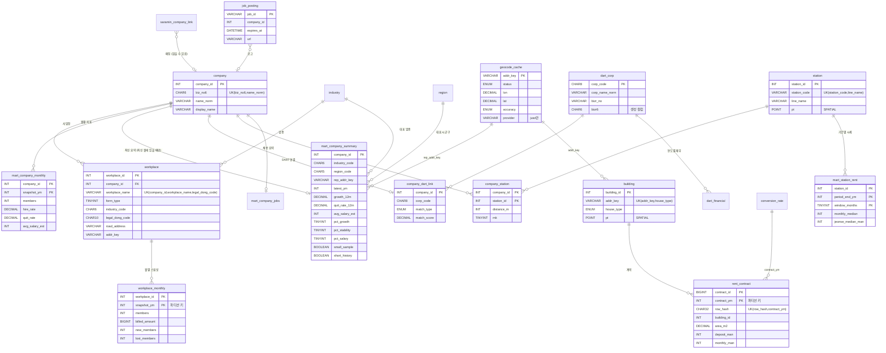

# 04. 데이터베이스 설계

| 항목 | 내용 |
|---|---|
| 대상 | T2(스키마 · SQL 담당), DB를 읽고 쓰는 T1 · T3 |
| 기준 | SPEC 5장(DDL), 6장(계산 규칙), 7장(핵심 SQL). 충돌하면 SPEC을 따르고, 이 문서의 "제안"은 SPEC에 반영되기 전까지 확정이 아니다 |
| 상태 | 초안 · 2026-10-08 |

---

## 1. 데이터 구조 결정

| 결정 | 내용 | 이유 |
|---|---|---|
| DBMS | MariaDB 11.4 LTS, InnoDB, `utf8mb4_unicode_ci` | 윈도 함수 · CTE · 파티셔닝 · 생성 컬럼 · SPATIAL 인덱스를 모두 지원. 로컬 · CI · 배포 버전 통일 |
| 3계층 | `raw_*` → core → `mart_*` | 원본 보존(정제 규칙이 바뀌면 다시 만든다), 정규화, 미리 집계(API는 mart만 읽는다) |
| 회사 단위 | `company` = `biz_no6` + `name_norm`이 같은 사업장 묶음 | 국민연금은 사업자번호 앞 6자리만 공개하므로 이름과 함께 묶어야 한다 |
| 시간 단위 | 월은 `INT YYYYMM`(`snapshot_ym`, `contract_ym`) | `PERIOD_ADD`로 월 연산, 파티션 키로 사용 |
| 금액 단위 | 국민연금 원, 전월세 만 원(`*_man`), 연봉 추정 원 | 원본 단위를 유지하고 화면에서 바꾼다 |
| 좌표 | `POINT(경도, 위도)` WGS84, `SRID` 속성 없음 | MariaDB 문법 제약(SPEC 5.3). juso 좌표만 저장 |
| 기준값 | `nps_rate`, `conversion_rate` 테이블 | 보험료율 · 상한 · 전환율이 기간마다 바뀐다. 코드 상수로 두지 않는다 |
| 멱등 | 자연키 UNIQUE + `INSERT … ON DUPLICATE KEY UPDATE`, 전월세는 `row_hash` | 같은 입력을 다시 넣어도 결과가 같아야 한다 |
| 파티션 | `workplace_monthly`(연 단위), `rent_contract`(월 단위, 24개월 순환) | 가장 큰 두 테이블. 오래된 전월세는 `DROP PARTITION`으로 지운다 |

## 2. ERD (초안)

SPEC 5.2에 DDL이 있는 테이블은 그대로 옮겼고, DDL이 없는 테이블은 **제안**으로 표시했다(3장).



운영 · 기준 테이블(`ingestion_log`, `api_call_log`, `nps_rate`, `conversion_rate`)과 raw 테이블은 다른 테이블과 키로 연결되지 않아 그림에서 뺐다. `nps_rate`는 `snapshot_ym BETWEEN valid_from_ym AND valid_to_ym` 범위 조인으로 쓰인다.

## 3. 테이블 관계 결정

| 관계 | 카디널리티 | 강제 방식 | 비고 |
|---|---|---|---|
| company → workplace | 1:N | FK (SPEC DDL) | 회사의 모든 사업장 |
| workplace → workplace_monthly | 1:N | 애플리케이션(적재기) | 파티션 테이블은 FK를 걸 수 없다 |
| company → mart_company_summary | 1:0..1 | 없음(mart) | 최신 월에 없는 회사는 행이 없다 → API가 `stale`로 응답 |
| company → company_dart_link → dart_corp | 1:0..1:1 | 없음 | 한 회사는 DART 법인 하나에만 연결. 미연결이면 행 없음 |
| company ↔ station (company_station) | N:M, 회사당 최대 3 | 없음(mart 성격) | 대표 사업장 기준, 1km 이내 |
| building → rent_contract | 1:N | 없음 | 좌표 변환 전 계약은 `building_id` NULL |
| saramin_company_link → company | N:0..1 | 없음 | `match_type='none'`이면 company_id NULL |
| 대표 사업장 | company당 1 | q2에서 계산 | 최신 월 가입자 수 최대(동률은 `workplace_id` 작은 쪽) |

mart와 매칭 테이블에 FK를 걸지 않는 이유: 배치가 테이블을 통째로 다시 만들기 때문에 FK가 있으면 삭제 · 재적재 순서가 꼬인다. 정합성은 SQL 회귀 테스트로 확인한다.

### SPEC에 DDL이 없는 테이블 (제안)

```sql
CREATE TABLE industry (
  industry_code CHAR(6) PRIMARY KEY,
  industry_name VARCHAR(100) NOT NULL
);

CREATE TABLE ingestion_log (
  run_id      BIGINT AUTO_INCREMENT PRIMARY KEY,
  source      VARCHAR(30) NOT NULL,          -- nps, dart_corp, rent, saramin ...
  target      VARCHAR(30),                   -- 예: 202608
  checksum    CHAR(64),
  status      ENUM('running','success','failed','skipped') NOT NULL,
  row_count   INT,
  message     VARCHAR(500),
  started_at  DATETIME NOT NULL,
  finished_at DATETIME,
  KEY ix_source_checksum (source, checksum, status)
);

CREATE TABLE api_call_log (
  source    VARCHAR(30) NOT NULL,
  call_date DATE NOT NULL,
  count     INT NOT NULL DEFAULT 0,
  PRIMARY KEY (source, call_date)
);

CREATE TABLE dart_financial (
  corp_code        CHAR(8) NOT NULL,
  bsns_year        SMALLINT NOT NULL,
  reprt_code       CHAR(5) NOT NULL,         -- 11011 사업보고서
  revenue          BIGINT,
  operating_income BIGINT,
  net_income       BIGINT,
  total_liabilities BIGINT,
  total_equity     BIGINT,                   -- 부채비율 = 부채 ÷ 자본
  PRIMARY KEY (corp_code, bsns_year, reprt_code)
);

CREATE TABLE mart_company_jobs (
  company_id        INT PRIMARY KEY,
  open_jobs         SMALLINT NOT NULL,
  nearest_expires_at DATETIME,
  signal            ENUM('growth','backfill','none') NOT NULL,
  posted_salary_min INT,                     -- 만 원
  posted_salary_max INT,
  refreshed_at      DATETIME NOT NULL,
  KEY ix_expires (nearest_expires_at)
);
```

`raw_nps_workplace`, `raw_rent_contract`, `raw_saramin_job`의 컬럼은 원본 헤더를 그대로 따르므로 Phase 1 프로파일링(`pipeline/nps/columns.py`, `docs/profiling.md`) 뒤에 확정한다. 공통으로 `snapshot_ym`(또는 수집일)과 적재 `run_id`를 둔다.

## 4. 설계 검토: 발견한 문제점

심각도: **높음** = 틀린 숫자가 화면에 나간다, **중간** = 기능이나 성능에 문제, **낮음** = 정리하면 좋다.

| # | 심각도 | 문제 | 근거 | 제안 |
|---|---|---|---|---|
| D1 | 높음 | **q2가 사라진 회사의 요약을 지우지 않는다.** `REPLACE INTO`는 결과에 있는 행만 바꾼다. 지난달 있다가 이번 달 없어진 회사는 지난달 요약이 그대로 남아, SPEC의 "최신 월에 없는 회사는 summary에 행이 없다"가 깨진다 | SPEC 7장 q2, 5.2 주석 | q2 앞에 `DELETE FROM mart_company_summary`(같은 트랜잭션), 또는 새 테이블에 만든 뒤 `RENAME TABLE`로 교체. 회귀 테스트 "최신 월에 없는 회사는 행 없음"을 **두 달 연속 적재** 시나리오로 작성 |
| D2 | 높음 | **q1이 `nps_rate`와 INNER JOIN이라, 기준표에 없는 달은 조용히 빠진다.** 초기값이 202407부터라 그 이전 파일을 백필하면 행이 사라진다 | SPEC 7장 q1 | 적재 전 품질 검사에 "적재 월이 `nps_rate` 범위 안인가"를 추가하고, 범위 밖이면 `failed` |
| D3 | 중간 | **상호가 바뀌면 회사가 둘로 갈린다.** `company`의 키가 `biz_no6 + name_norm`이라 "예시소프트" → "예시소프트웨어"면 새 회사가 생기고 추이가 끊긴다 | SPEC 5.2 `uk_company` | MVP는 그대로 두고 한계로 표시. 이후 같은 `biz_no6` · 같은 주소 · 이름 유사도 높은 회사를 묶는 `company_alias` 검토 |
| D4 | 중간 | **q1도 사라진 행을 지우지 않는다.** raw를 정정해 어떤 회사-월이 없어져도 `mart_company_monthly`에는 남는다 | SPEC 7장 q1 | 갱신 대상 월 범위를 지운 뒤 다시 넣는다(`DELETE … WHERE snapshot_ym BETWEEN`) |
| D5 | 중간 | **q6가 `DELETE` 후 `INSERT`라 그 사이 API가 빈 결과를 볼 수 있다.** 또 대표 사업장을 `workplace_monthly`에서 다시 계산해 q2와 기준이 둘이 된다 | SPEC 7장 q6 | 한 트랜잭션으로 묶고, 대표 주소는 `mart_company_summary.rep_addr_key`를 쓴다 |
| D6 | 중간 | **표본 부족 회사가 백분위 계산에 그대로 들어간다.** 가입자 3~9명 회사의 극단값(퇴사율 50% 등)이 업종 분포를 흔든다 | SPEC 7장 q2 | 백분위 분모에서 `small_sample` 회사를 빼고, 그 회사들의 백분위는 NULL로 둔다. 업종 분포 API(`p25/p50/p75`)도 같은 기준 |
| D7 | 중간 | **`mart_station_rent`는 12 · 24개월만 미리 집계하는데, 화면은 6개월도 고른다.** `/stations/{id}/rent`는 1~24개월을 "요청 시 계산"이라 "요청 시점에 집계하지 않는다" 원칙과 충돌한다 | SPEC 7장 q5, 8장 | `window_months`에 6을 추가하고, API의 `months`는 6 · 12 · 24만 받는다. 1~24 자유 입력은 뺀다 |
| D8 | 낮음 | SPEC에 DDL이 없는 테이블이 6개다(`industry`, `ingestion_log`, `api_call_log`, `dart_financial`, `mart_company_jobs`, raw 3종) | SPEC 5.1 vs 5.2 | 3장 제안 DDL을 T2가 검토해 SPEC에 반영 |
| D9 | 낮음 | `workplace_monthly` 파티션이 `p2026`까지라 2027년 데이터는 `pmax`에 쌓인다 | SPEC 5.2 | 연 1회 `REORGANIZE PARTITION pmax`를 운영 문서(runbook)에 넣는다 |
